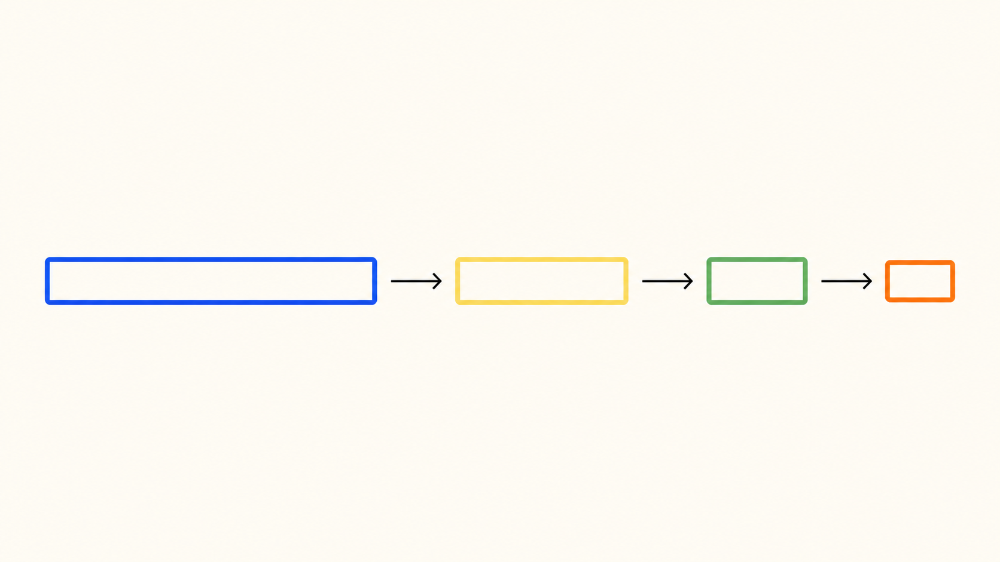

# short-url

轻量、可自托管的短链接服务，运行在 Cloudflare Pages Functions（Workers 运行时）上。



`short-url` 将长链接映射为简短、易记的 slug；短链跳转使用 Cloudflare KV，账号与可选访问统计使用 Cloudflare D1。

## 功能

- 自定义或自动生成短链 slug
- 注册、登录与个人短链管理
- 可选的访问来源统计
- 管理端：查看表结构、处理违规链接、封禁用户
- GitHub 推送自动触发 Cloudflare Pages 部署

## 架构

| 部件 | 用途 |
| --- | --- |
| Cloudflare Pages Functions | 页面路由、登录、短链管理与跳转逻辑 |
| Cloudflare KV (`KV_EV`) | `slug → 目标地址` 的低延迟查找 |
| Cloudflare D1 (`D1_EV`) | 用户、slug 列表与访问统计 |
| Cloudflare Pages Secrets | 仅保存管理员密码 `ADMIN_PASS` |

## 部署

### Git 集成

在 Cloudflare Pages 导入本仓库后，使用以下设置：

| 设置 | 值 |
| --- | --- |
| Production branch | `main` |
| Build command | `exit 0` |
| Build output directory | `.` |
| Root directory | 留空 |

### 绑定与密钥

在 `wrangler.jsonc` 中配置或替换资源 ID，并确保绑定名称保持不变：

- KV namespace：`KV_EV`
- D1 database：`D1_EV`

在 Cloudflare Pages 的 **Settings → Variables and Secrets** 中创建：

- `ADMIN_PASS`：类型为 **Secret**，用于 `/admin` 管理页。

请勿把 `ADMIN_PASS`、Cloudflare API Token 或其他凭据提交到仓库。KV/D1 的资源 ID 不是密钥，但应对应你自己的资源。

### 初始化 D1

首次部署前或后执行：

```sh
wrangler d1 execute <你的 D1 数据库名称> --remote --file migrations/0001_initial.sql
```

## 本地开发

```sh
wrangler pages dev .
```

本地运行时请提供等效的 KV、D1 绑定；不要将真实生产凭据写入 `.dev.vars` 后提交。

## 安全说明

当前版本为了个人演示体验移除了人机验证。若公开对外提供服务，建议额外配置限流、Turnstile、访问控制或其他反滥用措施。

## 致谢与项目来源

本项目基于 [4ev-link/4ev.link](https://github.com/4ev-link/4ev.link) 构建。感谢原作者公开其实现；本仓库保留原始 [CC0 1.0](LICENSE) 许可证与许可文本。

本仓库在原项目基础上完成了 Cloudflare Pages、KV 和 D1 部署配置，并替换了部署域名展示、项目文案与视觉样式。
